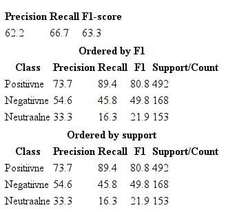
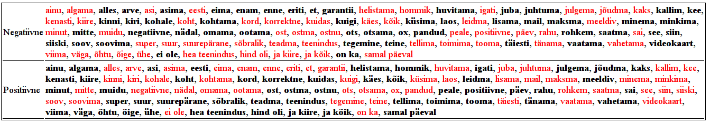

=========================================
Text classification tool
=========================================

Estnltk classifier is *machine learning* software for organizing data into categories.
It is a separate tool from estnltk, although it depends on it.
See the repository https://github.com/estnltk/textclassifier .

To install it from the PyPi repository, type::

    pip install estnltk-textclassifier
    
And run unit tests::

    python -m unittest discover textclassifier

::

    Ran 40 tests in 16.088s

    OK
    

Usage
=====

Let's start right away with an example to show what kind of problems the software is designed to solve.
Consider you are given a dataset of user reviews and have to classify them either as positive, negative or neutral (See ``data/hinnavaatlus.csv`` for full dataset):

==============  ======================================================================================================================================================================================================================================================================================================================= ==========
Kommentaari ID  Kommentaar                                                                                                                                                                                                                                                                                                              Meelsus
==============  ======================================================================================================================================================================================================================================================================================================================= ==========
4               Väike, aga tubli firma!                                                                                                                                                                                                                                                                                                 Neutraalne
8               väga hea firma                                                                                                                                                                                                                                                                                                          Positiivne
10              Viimasel ajal pole midagi halba öelda, aga samas ei konkureeri nad kuidagi Genneti, Ordiga ei hindadelt ega teeninduselt. Toorikute ja tindi ostmiseks samas hea koht ja kuna müüjaid on rohkem valima hakatud, siis võiks 2 ikka ära panna - tuleks 3 kui hinadele ei pandaks kirvest ja toodete saadavus oleks parem. Negatiivne
11              Fotode kvaliteet väga pro ja "jjk" seal töötamise ajal leiti ikka paljudele asjadele väga meeldivad lahendused. Samas hilisem läpaka ost sujus ka väga meeldivalt - sain esialgse rahas ostusoovi vormistada ümber järelmaksule...äärmiselt asjalik teenindus.                                                          Positiivne
13              Ainult positiivsed kogemused                                                                                                                                                                                                                                                                                            Positiivne
16              Viimane kord, kui käisin suutis leti taga askeldav ~60 aastane mees tegutseda nii aeglaselt, et minu seal veedetud 10min jooksul pani juba vähemalt 6-7 klienti putku. Garantiiga ka kurvad kogemused, neid poleks, saaks isegi kahe vast. Vihaseks ajab lihtsalt vahest nende teenindus!                               Negatiivne
17              Väga head hinnad!!!                                                                                                                                                                                                                                                                                                     Positiivne
==============  ======================================================================================================================================================================================================================================================================================================================= ==========

*NB! All file I/O of the software assumes the UTF-8 encoding.*

Step 1. Defining the classification task
----------------------------------------

One needs to tell the software, what columns contain features and what columns contain the results.
This can be done by writing a definitions file (let's call it ``hinnavaatlus.def``), which in our example case would look like::

    [features]
    Kommentaar
    [label]
    Meelsus
    [confidence]
    Kindlus

* The ``[features]`` section contains one feature column name per row.
  Our example only has one feature column.
  We exclude the *comment id* column as it does not contain any information about the user opinion.
* The ``[label]`` section contains the name of the column, where the category label is.
* The ``[confidence]`` is the name of the column, where the classification confidence is stored (this will be discussed later).

Step 2. Building the classification model
-----------------------------------------

In this example, we use the command line training program to build a model for Hinnavaatlus.ee user review classification.
We can see the possible parameters by issuing command::

    python3 -m textclassifier.train -h
    
That will output::

    usage: textclassifier.train [-h] [--synonyms SYNONYMS] [-r REPORT]
                                [--sheet SHEET] [--sep SEP]
                                settings dataset model

    positional arguments:
    settings              Settings definitions containing features columns,
                            label column and confidence column.
    dataset               Dataset to use for training. Must contain columns
                            defined in settings file. It is possible to load .csv
                            and .xlsx files.
    model                 The path to store the trained model.

    optional arguments:
    -h, --help            show this help message and exit
    --synonyms SYNONYMS   File containing a set of technical synonyms, one set
                            per line.
    -r REPORT, --report REPORT
                            The name of the report. The report is written as two
                            files [name].html and [name]_misclassified_data.html
    --sheet SHEET         Sheet name if loading data from Excel file (default
                            read the first sheet).
    --sep SEP             Column separator for CSV files (default is ,).

There are two parameters we need to discuss separately.

First one is the ``--synonyms`` parameter, which can be used to fine-tune the classifyer by specifiyng a list of technical synonyms.
The argument should contain the path to a file, where each line defines a list of synonyms. For our example, we could define a file like::

    firma ettevõte kauplus
    sülearvuti läpakas rüperaal laptop
    
This file is optional, but can be used to enhance the classification accuracy.

The second parameter is ``--report`` that does additional computation during training and creates two HTML files containing detailed performance characterstics of the trained model (this will be discussed more indepth later).
The report can be used to improve the categories of the data, to increase the technical synonym list etc.

However, we currently ignore this extra functionality and just train the classifier by issuing command::

    python3 -m textclassifier.train definitions/hinnavaatlus.def data/hinnavaatlus.csv models/hinnavaatlus.bin

Often the log outputs warnings related to ``numpy``, ``sckikit-learn`` and other dependencies, but these can be ingored until no specific errors are generated.
The reason is that the dependencies are constantly being developed and upgraded and most warnings are related to their development::

    INFO:train:Loading settings from definitions/hinnavaatlus.def and techsynonyms from None .
    Namespace(dataset='data/hinnavaatlus.csv', model='models/hinnavaatlus.bin', report=None, sep=',', settings='definitions/hinnavaatlus.def', sheet=0, synonyms=None)
    INFO:root:Reading dataset data/hinnavaatlus.csv
    INFO:clf:Training new model with settings{'unifier': <Estnltk.synunifier.SynUnifier object at 0x7f830a450f60>, 'label': 'Meelsus', 'confidence': 'Kindlus', 'features': ['Kommentaar']} and dataframe with 813 rows
    DEBUG:clf:Fitting classifier with 456 features and 813 examples and 3 disctinctive labels
    INFO:clf:Skipping report generation.
    INFO:clf:Training finished. Took total of 2.2 seconds.
    INFO:root:Saving classifier to models/hinnavaatlus.bin
    INFO:train:Done!

The log tells as that the trained model uses a combination of 456 word phrases for classification and that the full dataset contained 813 user reviews.
The saved model is stored in ``models/hinnavaatlus.bin`` file.

..note:: The classifier is capable of working with both CSV and XLSX files, but make sure CSV files use character " for quoting.
         With Excel XLSX, we have had problems loading the dataset, if Excel contains some extra functionality.
         For example, the software cannot load XLSX files with Data Autofilters.

Step 3. Using the model to categorize data
-------------------------------------------

The classification command line program accepts following arguments::

    $ python3 -m textclassifier.classify -h
    usage: textclassifier.classify [-h] [--insheet INSHEET] [--insep INSEP]
                             [--outsheet OUTSHEET] [--outsep OUTSEP]
                             indata outdata model

    positional arguments:
      indata               Path for the input dataset that will be classified. It
                           is possible to load .csv and .xlsx files.
      outdata              Path where the classified dataset will be stored. It is
                           possible to save .csv and .xlsx files
      model                The path of the classification model.

    optional arguments:
      -h, --help           show this help message and exit
      --insheet INSHEET    Sheet name if reading data from Excel file (default is
                           the first sheet).
      --insep INSEP        Column separator for reading CSV files (default is ,).
      --outsheet OUTSHEET  Sheet name if saving as an Excel file (default is
                           Sheet1).
      --outsep OUTSEP      Column separator for saving CSV files (default is ,).
      

The data we want to categorize has to have all columns that we defined in ``[features]`` section in classification task definitions file ``hinnavaatlus.def`` that we used during training/model building step.
The software will fill out the ``[label]`` and ``[confidence]`` columns itself.
The datafiles can contain other columns such as IDS, dates etc that are not used by the classifier, but stored in output as well.

Consider these four example reviews I have written (``data/hinnavaatlus_test.csv``). We expect the first to be positive, second negative, third positive and last one also negative.

+----------------------------------------------------------------------------------------------------------+
| Kommentaar                                                                                               |
+==========================================================================================================+
| Ettevõttega ainult positiivsed kogemused                                                                 |
+----------------------------------------------------------------------------------------------------------+
| Sain firmaga petta, tellisin toote internetist, aga toodet ei tulnud, samuti ei ole saanud tagasi raha.  |
+----------------------------------------------------------------------------------------------------------+
| Kõik toimis nii nagu lubatud: arvuti tuli kohale õigeaegselt ja kõik toimis.                             |
+----------------------------------------------------------------------------------------------------------+
| Muidu ok, aga toode läks pärast nädalast kasutamist rikki. Garantiiremont on aega võtnud juba üle kuu!!  |
+----------------------------------------------------------------------------------------------------------+

Let's classify the dataset::

    $ python3 -m textclassifier.classify data/hinnavaatlus_test.csv result.csv models/hinnavaatlus.bin 
    INFO:root:Reading dataset data/hinnavaatlus_test.csv
    INFO:root:Loading classifier from models/hinnavaatlus.bin
    INFO:classify:Performing classification on 4 examples.
    INFO:clf:Starting classification task.
    INFO:clf:Classification completed. Took total of 0.0 seconds.
    INFO:root:Writing dataset result.csv
    INFO:classify:Done!

We save the results into file ``results.csv``, which contains the following:

=======================================================================================================  ===========  =============
Kommentaar                                                                                               Meelsus      Kindlus     
=======================================================================================================  ===========  =============
Ettevõttega ainult positiivsed kogemused                                                                 Positiivne   0.7380716036
Sain firmaga petta, tellisin toote internetist, aga toodet ei tulnud, samuti ei ole saanud tagasi raha.  Negatiivne   0.4742324816
Kõik toimis nii nagu lubatud: arvuti tuli kohale õigeaegselt ja kõik toimis.                             Positiivne   0.7829001265
Toode läks pärast nädalast kasutamist rikki. Garantiiremont on aega võtnud juba üle kuu!!                Negatiivne   0.8060670574
=======================================================================================================  ===========  =============

We see that instead of one column, there are now also label and confidence columns named *Meelsus* and *Kindlus* respectively.
Although we see that this time the classifier has correctly categorized all four examples, it is not always the case.
Classifier makes errors as it is not always possible automatically tell from the text, what is the correct category.
Confidence value and its usage is covered later when we discuss the automatically generated report.

Debugging the classifier
========================

The classifier learns the properties it needs to classify data from the training data supplied at the model building step.
What it does in general, is that it computes the correlation between words and category labels and then uses this information to predict the most probable outcome.
As it uses statistical reasoning to make its decision, there will be errors. Few reasons why errors are made:

1. For a certain category label, there may be too few examples. This makes it hard to learn the properties of the category.
2. One or more categories may be semantically very similar, thus making it harder to make difference between them.
3. The dataset that the classifier was trained on, is too old or too different from the dataset that its used to predict categories.

During the model building step, we can optionally generate report that gives detailed information about how many errors the classifier is expected to make and what categories are most troublesome.
Let's use our hinnavaatlus.ee example dataset and build a model now with a generated report::

    $ python3 -m textclassifier.train definitions/hinnavaatlus.def data/hinnavaatlus.csv models/hinnavaatlus.bin --report hinnavaatlus
    INFO:train:Loading settings from definitions/hinnavaatlus.def and techsynonyms from None .
    ...
    INFO:root:Saving classifier to models/hinnavaatlus.bin
    INFO:root:Writing HTML content to hinnavaatlus.html
    INFO:root:Writing HTML content to hinnavaatlus_misclassified_data.html
    INFO:train:Done!

For the purposes of the report, the classifier splits the dataset into ten pieces and performs ten train-test cycles to evaluate its precision.
This is called *stratified 10-fold cross-validation*.
This is required in order to get realistic estimates how the model will perform on unseen data.
Report can be generated only on training dataset as we need *true* categories for estimating the accuracy.
However, as the cross-validation uses random splits each time, there are smaller variations in the reported accuracy.
The resulting classifier will be built using full data, so the real accuracy should be always slightly better
than the number reported.

But let's now analyze the contents of ``hinnavaatlus.html`` document.

Classification report
---------------------

The first section of the ``hinnavaatlus.html`` file contains the classification report:

It denotes the *precision*, *recall* and *F1-score* for each category as seen above.
The most important metric is the F1-score, the harmonic mean of precision and recall.
See http://en.wikipedia.org/wiki/Precision_and_recall for detailed descriptions of these metrics.

We see that the *positive* reviews are most easy to detect.
Partly, this is because there are about 500 such reviews, twice as much as *negative* and *neutral* combined.

But overall, we see that the F1-score is pretty low as about only 60% of predictions are correct.
Now, one tip on improving the overall accuracy is to minimize the number of different categories.
For example, if we would like to do market analysis on how the public opinion about various companies differs in time,
we can join the *neutral* reviews with *negative* ones.
Time series of number of *neutral* opinions would not be interesting to marketing staff anyway.
So, we can essentially trade *neutral* reviews for better overall accuracy.

Let's see, if this tip makes a difference. File ``data/hinnavaatlus_simple.csv`` contains same training data as before, but now only with *positive* and *negative* classes.
After retraining, we see following numbers in classification report.

.. image:: _static/classification_report_improved.png
   :alt: Classification report
   
We see that this simple change increased the overall accuracy by 20 percent points, from 63.3% before to 80.3% now.
Thus, one simplest, but most effective way to increase the performance is to use only categories, which are required for a particular task.

Confidence cutoff vs F1 curve
------------------------------

As discussed earlier, the ``confidence`` column denotes how confident is the prediction.
Each classified data point has a confidence score -- the higher the score, the lower the probability of making an error.
In other words, it describes how hard it is to classify the data point.
The plot shows how the overall accuracy changes by including only data points where the confidence is greater or equal to the confidence cutoff treshold.

.. image:: _static/confidence.png
   :alt: Confidence cutoff / F1 curve
   :width: 30em

The red line depicts the 90% accuracy and green line 95% accuracy.

The second tip to improve overall accuracy of the predictions is to throw away examples that are harder to classify.
Confidence cutoff / F1 curve helps to determine the high enough confidence to obtain certain accuracy.

In this case, confidence >= 80% will give us overall accuracy of 90%.
This is especially useful, if we have a lot of data and can throw some of it away for the sake of better accuracy.
However, be careful, as the confidence of the predictions depend on their true categories, some of them may be naturally harder to classify.
Thus, when filtering the results by their confidence, the proportions of classes in filtered result might change and get out of original proportion.

Whether this is a problem or not, depends much on for what kind of statistics the results are needed for.
For example, when we compare the change of ratio of positive and negative reviews for some company over four quarters of a year, we only require that the proportions of the predictions are consistent.
Thus, when we use same confidence cutoff for all quarters, there should not be any problems.

On the other hand, if we are interested in ratios, we could still use the full dataset, even if the overall accuracy is lower.
In case of computing ratios, some errors can cancel each other out.
For example, a negative review classified as positive and a positive one classified as negative cancel each other out.
In any way, these ratios need to interpreted with knowing that they are based on data, that is 80% accurate.

Coverage vs F1 curve
--------------------

The coverage plot shows how the overall accuracy changes by removing data that is harder to classify.
Typically, by removing the harder examples, we obtain better overall accuracy.
This is complementary to confidence cutoff vs F1 curve described in previous section.

.. image:: _static/coverage.png
   :alt: Coverage / F1 curve
   :width: 30em
   

We see that for obtaining 90% accuracy, we can keep only 55% of the data.

Significant features by labels
------------------------------

The next section displays 100 most significant features for each category.
Features written in black and red denote features that are respectively contributing towards and against assigning the particular class label.
Both are equally important, but they should be interpreted differently, when debugging the classifier.

Our current example uses only two categories, thus the important features are exactly the opposite of each other. In case of three or more categories,
there will be more variations.

Misclassified examples
----------------------

File ``hinnavaatlus_misclassified_data.html`` contains a number of sections and lists all examples that were misclassified.
It displays the *true category label* and the *predicted category label*.

.. image:: _static/misclassified_data.png
   :alt: Misclassified data
   :width: 60em

The first review is an example, where word "positive" tricks the classifier to think that the review is actually positive.
The negating word "ei" is too far away so the computer fails to understand the semantics of the review.
We also see some reviews that are hard to classify strictly as positive or negative as they contain both positive and negative feedback.
The misclassified data also has black and red bold words that denote the important features.

By analyzing the significant features and misclassified examples, one can see which features could be aggregated and write them as technical synonyms.
This can make it easier for the classifier to make predictions.

For example, let's create a file ``hinnavaatlus.txt`` containing some synonymous words::

    firma ettevõte kauplus pood
    sülearvuti läpakas rüperaal laptop
    suurepärane hea super superluks positiivne
    halb ebameeldiv tüütu

The first word of each line denotes the main synonym and all other words on the line are replaced by the first word.
Let's see, if this small change reflects in prediction accuracy::

    $ python3 -m estnltk.textclassifier.train definitions/hinnavaatlus.def data/hinnavaatlus_simple.csv models/hinnavaatlus.bin --report hinnavaatlus --synonyms hinnavaatlus.txt

.. image:: _static/classification_report_tech.png
   :alt: Classification report technical synonyms
   

Compared to previous 80.3%, we get a better result, although it is only 0.7 percent point higher score.
Also, note that due to cross-validation, different runs can give slightly different accuracy estimates.
But on average, the results of many runs tests should be improved.

