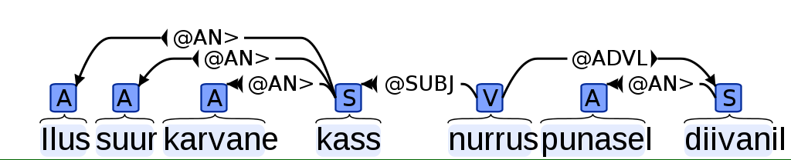

Syntax and dependency parser
============================

Estnltk has a wrapper for Estonian `dependency parser`_, which tags syntactic and dependency markers every word.
Make sure to check out the `documentation`_.

.. _dependency parser: https://korpused.keeleressursid.ee/syntaks/index.php?keel=ee
.. _documentation: http://kodu.ut.ee/~kaili/Korpus/pindmine/labels.pdf

::

    from estnltk import Text
    from pprint import pprint

    text = Text('Ilus suur karvane kass nurrus punasel diivanil')
    text.tag_syntax()

    pprint(text['words'])

The above example adds new attribute ``syntax`` to every word, which is a list.
The list usually contains only one element, but in case if ambiguity, there can be more.
Ever list element has four attributes:

* form - the form of the analyzed words,
* syntax - the syntax tags,
* intermediate - list of some extra tags,
* link - dependency links.

This is the output for the word ``ilus`` in above example::

     'syntax': [{'form': 'A pos sg nom cap',
                 'intermediate': [],
                 'link': '#1->4',
                 'syntax': ['@AN>']}],

The dependency graph is a better way to illustrate relations between every word:

