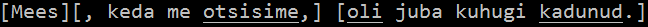
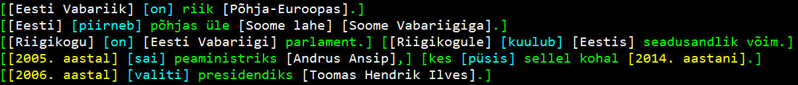

Terminal Prettyprinter
======================

In addition to HTML pretty-printing capabilities, Estnltk also provides
means for visualizing annotations in terminal: bracketing annotations,
displaying annotations in a custom color font, and/or underlining
annotations.

Basic usage
-----------

A straight-forward prettyprinting can be performed via the method
:py:meth:``terminalprettyprinter.tprint``, which takes three input
arguments: a ``Text`` object, a list of layer names (text annotation
layers to be visualized), and list of dicts containing formatting
options (how each layer should be visualized), and outputs formatted
text to the terminal. Example::

.. code:: python

    from estnltk import Text
    from estnltk.prettyprinter.terminalprettyprinter import tprint

    text = Text('''Eesti Vabariik on riik Põhja-Euroopas.
    Eesti piirneb põhjas üle Soome lahe Soome Vabariigiga.
    Riigikogu on Eesti Vabariigi parlament. Riigikogule kuulub Eestis seadusandlik võim.
    2005. aastal sai peaministriks Andrus Ansip, kes püsis sellel kohal 2014. aastani.
    2006. aastal valiti presidendiks Toomas Hendrik Ilves.
    ''').tag_all()

    # Print text in a manner that:
    #  1) clauses are bracketed,
    #  2) verb chains are underlined,
    #  3) timexes are colored white,
    #  4) named entities are colored green;
    tprint( text, ['clauses', 'verb_chains', 'timexes', 'named_entities'], [{'bracket':True},{'underline':True},{'color':'white'},{'color':'green'}] )

Note that using
:py:meth:``~estnltk.prettyprinter.terminalprettyprinter.tprint``
requires that the layers of annotations to be visualized are already
tagged in the input :py:class:``~estnltk.text.Text`` object -- if some
visualizable layer is missing in the input text, the method exits with
an error.

The previous example produces the following output (in a Windows
terminal):

   im

The list of annotation options must be same size as the list of layer
names, individually specifying how each layer should be formatted. The
pretty-printing function currently supports the following formatting
options:

-  ``'underline'`` (shortcut: ``'u'``) -- boolean indicating whether
   annotations of given layer should be underlined;
-  ``'bracket'`` (shortcut: ``'b'``) -- boolean indicating whether
   annotations of given layer should be bracketed;
-  ``'color'`` (shortcut: ``'c'``) -- string indicating color of the
   font in which the annotation is to be displayed; Supported color
   names: ``'red'``, ``'blue'``, ``'green'``, ``'white'``, ``'cyan'``,
   ``'purple'``, ``'yellow'``, ``'teal'``, ``'darkpurple'``,
   ``'darkblue'``, ``'olive'``, ``'darkgreen'``, ``'darkred'``,
   ``'grey'`` ;

*Limitations of terminal prettyprinting*
~~~~~~~~~~~~~~~~~~~~~~~~~~~~~~~~~~~~~~~~

Graphical formatting of annotations (changing color of the text, and/or
underlining annotations) can only be used in a terminal that interprets
*ANSI escape sequences* as text formatting commands. Not all terminals
support these commands, e.g. Python's IDLE environment lacks the
support. If the terminal does not support graphical formatting, the only
viable terminal-based visualization option is to surround the
annotations with brackets; using any other option (e.g. font coloring)
will simply produce text mingled with unexecuted ANSI escape sequences.

Default formatting
------------------

The method
:py:meth:``~estnltk.prettyprinter.terminalprettyprinter.tprint`` comes
with a set of predefined formatting options, in which all annotations
are bracketed and different layers are distinguished by distinct font
coloring. In order to use the default settings, simply skip the third
argument of the method::

.. code:: python

    from estnltk import Text
    from estnltk.prettyprinter.terminalprettyprinter import tprint

    text = Text('''Eesti Vabariik on riik Põhja-Euroopas.
    Eesti piirneb põhjas üle Soome lahe Soome Vabariigiga.
    Riigikogu on Eesti Vabariigi parlament. Riigikogule kuulub Eestis seadusandlik võim.
    2005. aastal sai peaministriks Andrus Ansip, kes püsis sellel kohal 2014. aastani.
    2006. aastal valiti presidendiks Toomas Hendrik Ilves.
    ''').tag_all()

    # Print text using default formatting options
    tprint( text, ['clauses', 'verb_chains', 'timexes', 'named_entities'] )

The above example produces the following output (in a Windows terminal):

   im

Up to 12 different layers of annotation can be visualized with default
settings; default colors are starting from the bright ones (``'green'``,
``'cyan'``, ``'yellow'``, ...) and ending with the dark ones (...,
``'darkblue'``, ``'olive'``, ``'darkred'``).
